<div align="center">


<h1>Database Migration Hub</h1>

<p><strong>The Enterprise Standard for Assessing, Planning, Automating, and Governing Global Database Transformation</strong></p>

[]()
[]()
[]()
[]()

<br/>

> **"Modernization is not just moving data; it's unlocking the power of your digital estate."** 
> Database Migration Hub is a flagship platform designed to enable enterprises to assess, plan, and execute large-scale database migrations across multi-cloud and hybrid environments.

</div>

---

## 🏛️ Executive Summary

**Database Migration Hub** is a flagship repository designed for Chief Technology Officers (CTOs), PMO leads, and Database Administrators (DBAs). As organizations exit legacy data centers and embrace cloud-native scalability, the bottleneck is often the "Massive Database Migration" (MDM).

This platform provides an industrialized approach to **Database Modernization**, delivering production-ready **Migration Engines**, **Compatibility Assessments**, **Schema Conversion Workflows**, and **Hypercare Dashboards**. It supports **Oracle**, **SQL Server**, **PostgreSQL**, **Snowflake**, and **MongoDB**, enabling teams to migrate thousands of instances with measurable reliability.

---

## 💡 Why Database Migration Matters

Modernization is the "Engine" of the digital transformation:
- **Cost Efficiency**: Eliminating expensive legacy hardware and licensing costs (OPEX vs CAPEX).
- **Global Scalability**: Leveraging cloud-native features like geo-replication and elastic compute.
- **Innovation Velocity**: Moving from "Monolithic Maintenance" to "Agile Data Innovation."
- **Security & Compliance**: Standardizing on secure, patched, and managed cloud database environments.

---

## 🚀 Business Outcomes

### 🎯 Strategic Modernization Impact
- **Accelerated Exit**: Reducing data center exit timelines by 40% through automated assessment and execution.
- **Near-Zero Downtime**: Achieving 99.99% availability during cutovers using real-time CDC synchronization.
- **Risk Mitigation**: Predicting and resolving compatibility issues before they reach the migration phase.
- **Unified Governance**: Providing executives with a "Single Pane of Glass" for the entire migration portfolio.

---

## 🏗️ Technical Stack

| Layer | Technology | Rationale |
|---|---|---|
| **Migration Engine** | Python, Airflow (optional) | High-performance orchestration of assessment and migration tasks. |
| **Control Plane** | FastAPI | High-performance API for portfolio management and cutover control. |
| **Frontend** | React 18, Vite | Premium portal for wave planning, risk heatmaps, and validation scorecards. |
| **IaC Foundation** | Terraform | Multi-cloud infrastructure consistency and landing zone automation. |
| **Database** | PostgreSQL | Centralized repository for migration metadata, inventories, and state. |
| **Observability** | Prometheus / Grafana | Real-time monitoring of migration progress and replication lag. |

---

## 📐 Architecture Storytelling: 65+ Diagrams

### 1. Executive High-Level Architecture
The holistic vision of the enterprise database transformation journey.

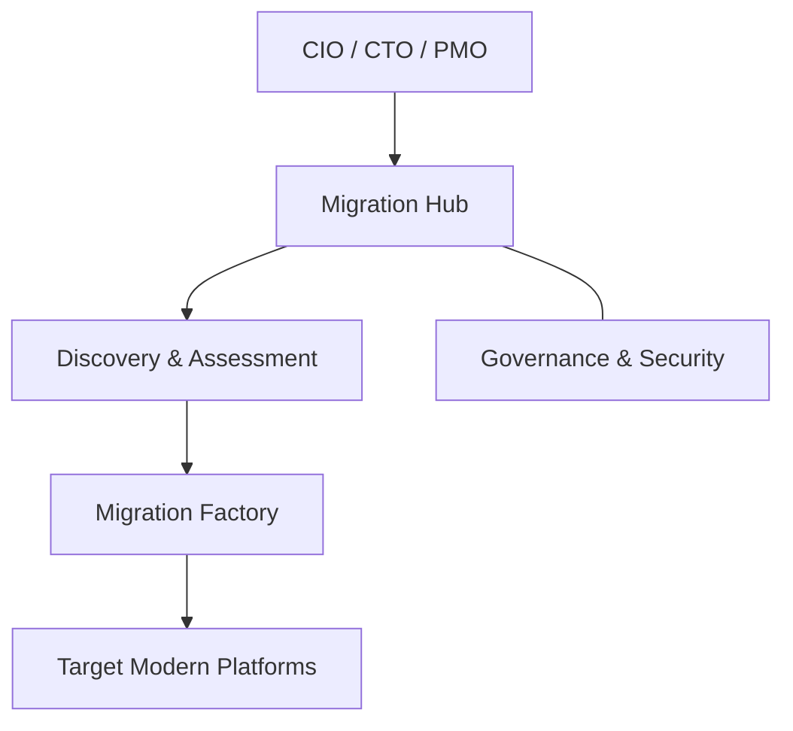

### 2. Detailed Component Topology
The internal service boundaries and management layers of the platform.

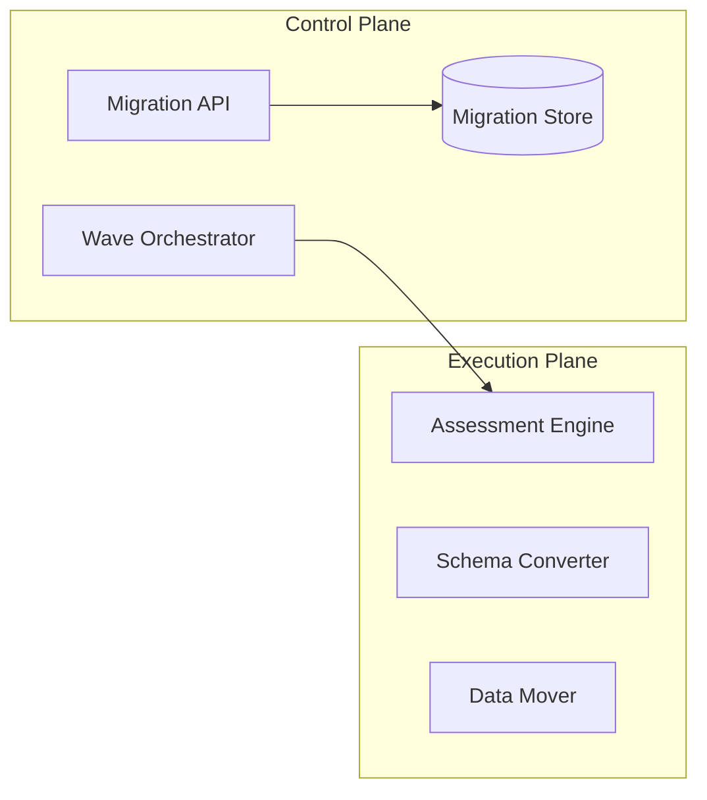

### 3. Frontend to Backend Request Path
Tracing an "Assess SQL Server Instance" request through the stack.

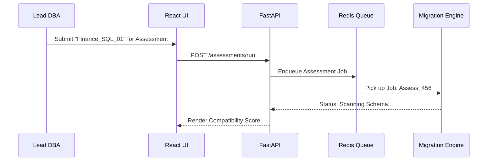

### 4. Migration Control Plane
The "Brain" of the framework managing multi-wave sync definitions.

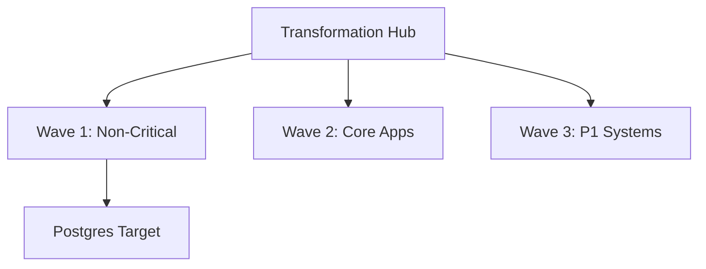

### 5. Multi-Cloud Target Topology
Synchronizing migration standards across Azure, AWS, GCP, and Hybrid.

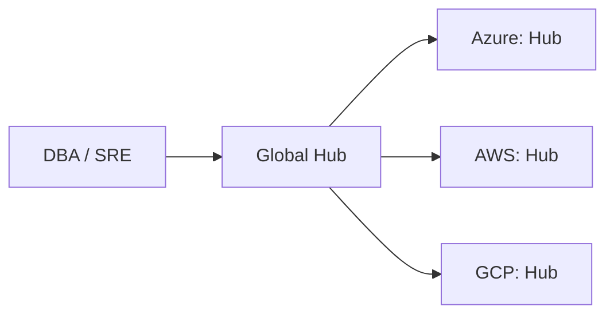

### 6. Regional Deployment Model
Hosting migration workers close to the source for performance.

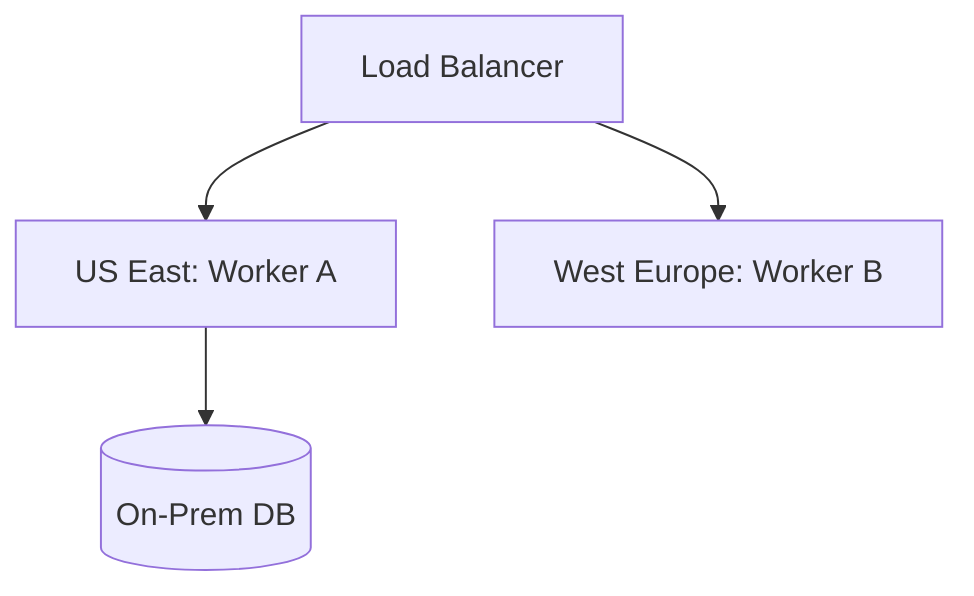

### 7. DR Failover Model
Ensuring migration continuity during regional cloud outages.

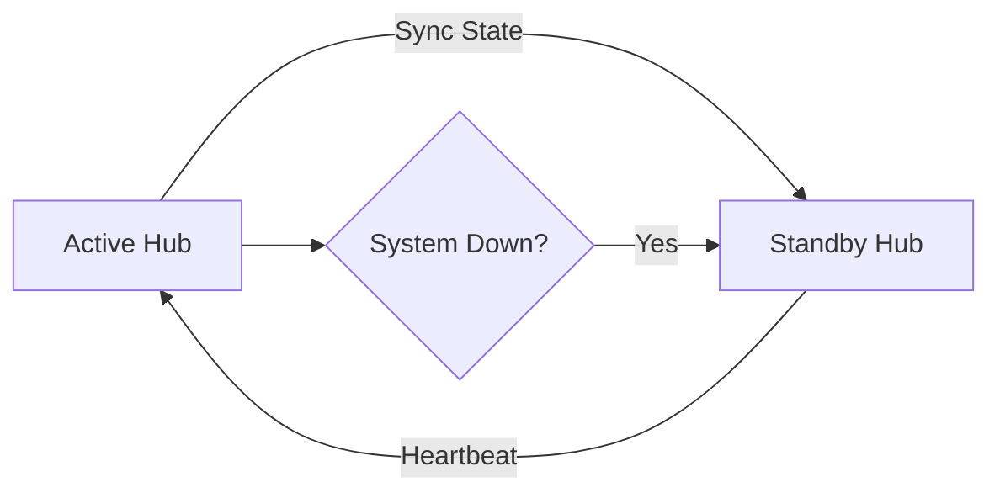

### 8. API Gateway Architecture
Securing and throttling the entry point for migration orchestration.

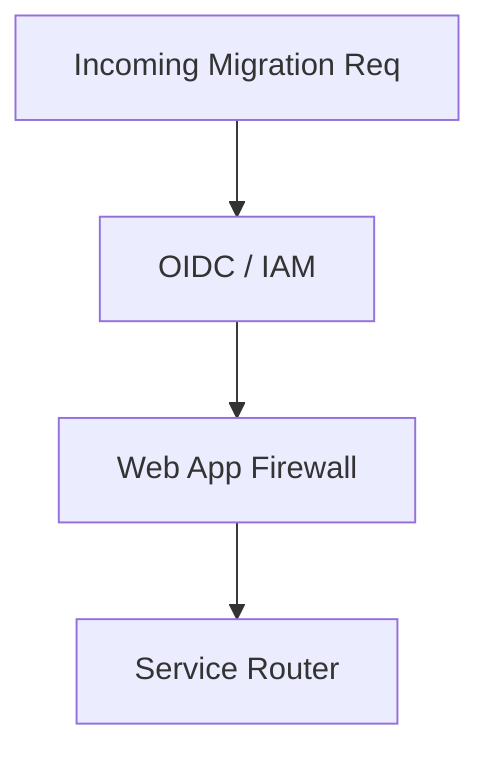

### 9. Queue Worker Architecture
Managing long-running assessment and data movement tasks at scale.

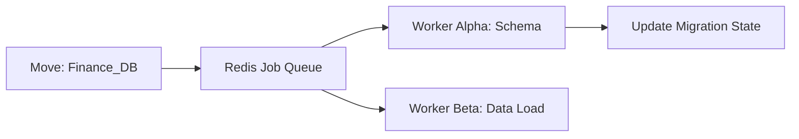

### 10. Dashboard Analytics Flow
How raw migration telemetry becomes executive transformation scorecards.

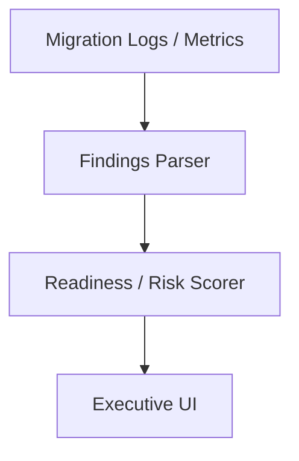

### 11. Source Inventory Workflow
Discovering and cataloging the legacy estate.

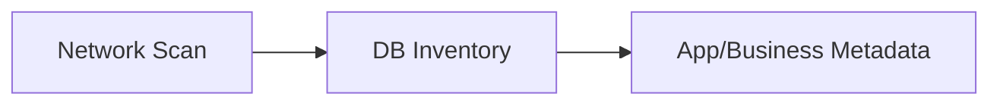

### 12. Dependency Discovery Model
Mapping inter-database and app-to-db linkages.

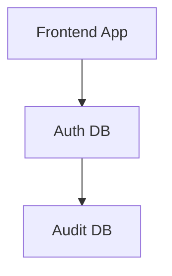

### 13. Application-to-database Mapping
Ensuring application silos are migrated in waves.

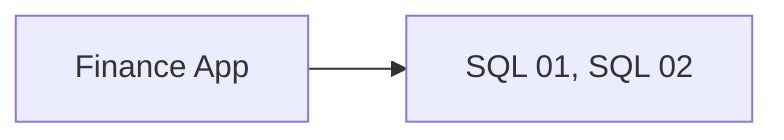

### 14. Version Compatibility Flow
Checking source vs target engine support.

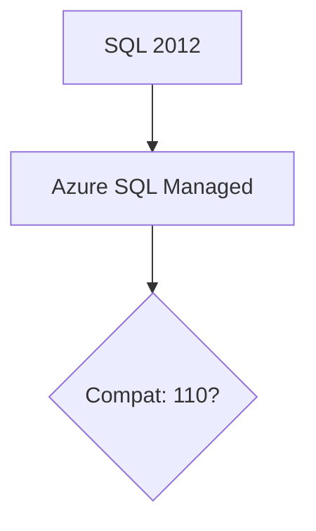

### 15. Readiness Scoring Model
Calculating the "Ease of Migration" for each instance.

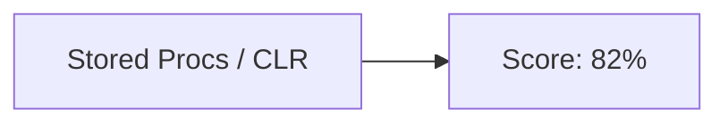

### 16. TCO Comparison Workflow
Analyzing on-prem vs cloud economics.

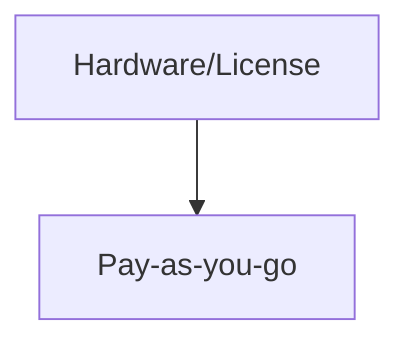

### 17. Risk Heatmap Generation
Visualizing migration complexity across the portfolio.

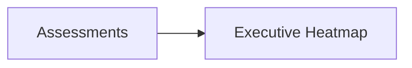

### 18. Wave Grouping Model
Clustering databases into logical migration events.

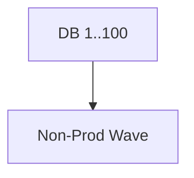

### 19. Stakeholder Approval Flow
Governing the "Go/No-Go" for each wave.

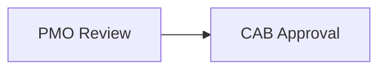

### 20. Migration Portfolio Governance
Tracking the status of all active and planned migrations.

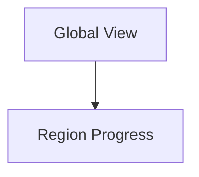

### 21. Schema Conversion Lifecycle
Automated translation of DDL and stored procedures.

```mermaid
graph LR
    Src_DDL[Oracle PL/SQL] --> Conv[Converter]
    Conv --> Tgt_DDL[PG plpgsql]
```

### 22. Full-load Migration Flow
Moving the bulk data snapshot to the target.

```mermaid
graph TD
    Snap[Snapshot] --> Stream[Data Pipe]
    Stream --> Load[Bulk Load]
```

### 23. Incremental Sync Workflow
Keeping source and target in sync after initial load.

```mermaid
graph LR
    Diff[Changes] --> Apply[Target Replay]
```

### 24. CDC Replication Model
Change Data Capture for zero-downtime cutovers.

```mermaid
graph TD
    Log[Tx Log] --> Miner[CDC Miner]
    Miner --> Target[Target DB]
```

### 25. Near-zero Downtime Cutover
The final switch from source to target.

```mermaid
graph LR
    Sync[Lag: <1s] --> Cutover[App Pointer Swap]
```

### 26. Rollback Workflow
Ensuring a safe path back to legacy if validation fails.

```mermaid
graph TD
    Fail[Post-Live Fail] --> Revert[DNS Revert]
```

### 27. Blue/Green Migration Model
Switching traffic between old and new clusters.

```mermaid
graph LR
    Traffic[Users] --> LB[Load Balancer]
    LB --> Green[Target Cluster]
```

### 28. Canary Migration Flow
Testing the new target with a subset of traffic.

```mermaid
graph TD
    Users[5% Traffic] --> Target[New DB]
```

### 29. Hypercare Lifecycle
Intensive post-migration support period.

```mermaid
graph LR
    Live[Go-Live] --> Support[24/7 Monitoring]
```

### 30. Coexistence Strategy Model
Running apps across both environments during transition.

```mermaid
graph TD
    App[Dual-Write App] --> S1[On-Prem]
    App --> S2[Cloud]
```

### 31. SQL Server to PostgreSQL
Modernizing enterprise SQL to open-source managed services.

```mermaid
graph LR
    SQL[MSSQL] --> SCT[Schema Convert]
    SCT --> PG[Postgres]
```

### 32. Oracle to Managed DB
Moving high-value Oracle workloads to RDS/Cloud SQL.

```mermaid
graph TD
    Ora[Oracle] --> DMS[Migration Service]
    DMS --> Tgt[Managed DB]
```

### 33. MySQL to Cloud DB
Standardizing on Aurora or Cloud SQL.

```mermaid
graph LR
    My[MySQL] --> Native[Cloud Native DB]
```

### 34. MongoDB Modernization Flow
Moving to Atlas or DocumentDB.

```mermaid
graph TD
    Mongo[On-Prem] --> Atlas[MongoDB Atlas]
```

### 35. Cassandra migration model
Moving to Cosmos DB or Managed Cassandra.

```mermaid
graph LR
    Cass[Cassandra] --> Cosmos[Azure Cosmos]
```

### 36. SQL to Snowflake pipeline
Feeding the cloud data warehouse.

```mermaid
graph TD
    SQL[Source] --> Snow[Snowflake]
```

### 37. SQL to BigQuery flow
GCP modernization path.

```mermaid
graph LR
    SQL[Source] --> BQ[BigQuery]
```

### 38. SQL to Synapse model
Azure analytics modernization.

```mermaid
graph TD
    SQL[Source] --> Syn[Synapse]
```

### 39. SQL to Fabric workflow
Feeding the Microsoft OneLake ecosystem.

```mermaid
graph LR
    SQL[Source] --> Fab[Fabric]
```

### 40. Polyglot Target Topology
Managing a diverse mix of target database engines.

```mermaid
graph TD
    Engine[Migration Hub] --> T1[Relational]
    Engine --> T2[NoSQL]
```

### 41. Row count reconciliation
Verifying all records were transferred correctly.

```mermaid
graph LR
    Src[Count: 1M] == Tgt[Count: 1M]
```

### 42. Checksum validation flow
Ensuring data integrity at the block level.

```mermaid
graph TD
    Hash_S[Source Hash] --> Compare{Match?}
    Hash_T[Target Hash] --> Compare
```

### 43. Query Parity Testing
Running the same application queries against both DBs.

```mermaid
graph LR
    Query[Select *] --> Res_S[Result S]
    Query --> Res_T[Result T]
```

### 44. Performance Benchmark Model
Comparing latency and throughput post-migration.

```mermaid
graph TD
    OnPrem[10ms] --> Cloud[8ms]
```

### 45. Index Optimization Workflow
Rebuilding indexes for cloud-native storage.

```mermaid
graph LR
    Raw[Unindexed] --> Optimized[Cloud-Ready Indices]
```

### 46. Query Tuning Lifecycle
Fixing slow queries on the new engine.

```mermaid
graph TD
    Slow[Explain Plan] --> Fix[Tune SQL]
```

### 47. SLA Acceptance Model
Verifying the target meets business performance targets.

```mermaid
graph LR
    Target[Latency < 50ms] --> Verify[PASS]
```

### 48. Defect Remediation Workflow
Tracking and fixing data mismatches.

```mermaid
graph TD
    Bug[Mismatch] --> Fix[Resync Range]
```

### 49. Compliance Evidence Workflow
Generating audit trails for the migration.

```mermaid
graph LR
    Audit[Logs] --> Report[SOX Compliance]
```

### 50. Final Go-Live Gate
The ultimate checklist before the "Big Red Button."

```mermaid
graph TD
    Check[Checklist] --> Live[GO-LIVE]
```

### 51. OIDC / SSO Auth Flow
Secure hub access.

```mermaid
graph LR
    User[User] --> Okta[Okta / Entra]
```

### 52. RBAC Model
Governing migration permissions.

```mermaid
graph TD
    Role[Migrator] --> Perm[Start Sync]
```

### 53. Secrets Management Flow
Securing source and target credentials.

```mermaid
graph LR
    Engine[Engine] --> Vault[HashiCorp Vault]
```

### 54. Encryption in Transit Workflow
Protecting data during movement.

```mermaid
graph TD
    Data[Data] --> TLS[mTLS 1.3]
```

### 55. Audit Logging Architecture
Centralized records of all migration actions.

```mermaid
graph LR
    Action[Cutover] --> Log[(Audit Log)]
```

### 56. Metrics Pipeline
Monitoring the hub's performance.

```mermaid
graph TD
    Hub[Hub] --> Prom[Prometheus]
```

### 57. Logging Architecture
Centralized application logs.

```mermaid
graph LR
    Pod[Hub Pod] --> Splunk[Splunk / ELK]
```

### 58. Tracing Model
Tracing migration requests across distributed workers.

```mermaid
graph TD
    Request[Start] --> Trace[OTel Trace]
```

### 59. Release Pipeline Workflow
Continuous delivery of the migration platform.

```mermaid
graph LR
    Git[Code] --> GHA[Build & Deploy]
```

### 60. Change Governance Workflow
Governing updates to migration logic.

```mermaid
graph TD
    Code[Update Logic] --> Peer[Peer Review]
```

### 61. Executive KPI Review Cycle
Reporting transformation progress to the board.

```mermaid
graph LR
    Data[Progress] --> Board[Quarterly Review]
```

### 62. PMO Governance Cadence
The rhythm of wave planning and status updates.

```mermaid
graph TD
    Weekly[Weekly Sync] --> Track[Jira / Azure DevOps]
```

### 63. Budget Tracking Workflow
Monitoring migration spend against allocation.

```mermaid
graph LR
    Spend[Cloud Cost] --> Budget[Limit: $2M]
```

### 64. Resource Capacity Planning
Managing the people move along with the data.

```mermaid
graph TD
    Team[Team Alpha] --> Tasks[Wave 4-6]
```

### 65. Transformation Roadmap
The long-term vision of the database estate.

```mermaid
graph LR
    Phase1[Assessment] --> Phase2[Execution]
    Phase2 --> Phase3[Modernization]
```

---

## 🔬 Database Modernization Methodology

### 1. The Migration Hub Pillars
Our platform is built on four core pillars:
- **Automation**: Reducing manual DBA effort by 70% through scriptable workflows.
- **Reliability**: Guaranteeing data integrity through multi-point validation.
- **Visibility**: Providing real-time progress tracking for every instance.
- **Security**: Ensuring credentials and data are encrypted throughout the lifecycle.

### 2. Migration Strategy Matrix (6Rs)
- **Rehost**: "Lift and Shift" to virtual machines.
- **Replatform**: Move to managed services (PaaS) with minimal code changes.
- **Refactor**: Modernize schema and logic for cloud-native engines.
- **Repurchase**: Move to SaaS alternatives.
- **Retire**: Decommission legacy systems.
- **Retain**: Keep on-prem (Hybrid coexistence).

---

## 🚦 Getting Started

### 1. Prerequisites
- **Terraform** (v1.5+).
- **Docker Desktop**.
- **Azure/AWS/GCP CLI** configured.

### 2. Local Setup
```bash
# Clone the repository
git clone https://github.com/Devopstrio/database-migration-hub.git
cd database-migration-hub

# Start the Migration Hub Control Plane
docker-compose up --build
```
Access the Migration Portal at `http://localhost:3000`.

---

## 🛡️ Governance & Security
- **Identity-First Security**: All migration actions are tied to authenticated identities via OIDC.
- **Immutable Evidence**: Validation reports and logs are stored in tamper-proof object storage.
- **Compliance-by-Design**: Built-in support for HIPAA, GDPR, and SOX data movement patterns.

---
<sub>&copy; 2026 Devopstrio &mdash; Engineering the Future of Industrialized Database Modernization.</sub>
