<div align="center">


<h1>Database Migration Hub</h1>

<p><strong>The Institutional-Grade Platform for Standardized Transformation Readiness, Database Modernization, and Multi-Cloud Cutover Ecosystems.</strong></p>

[]()
[]()
[]()

<br/>

> **"Industrializing migration to automate database transformation."** 
> **Database Migration Hub** is an enterprise-grade solution designed to provide a secure, measurable, and highly automated foundation for global database modernization operations. It orchestrates the complex lifecycle of transformation—from initial legacy assessment and schema conversion to zero-downtime replication and unified cutover auditing.

</div>

---

## 🏛️ Executive Summary

Fragmented migration scripts and manual schema conversions are strategic operational liabilities; lack of centralized modernization orchestration is a primary barrier to organizational cloud adoption and data center exits. Organizations fail to migrate successfully not because of a lack of target environments, but because of fragmented synchronization standards, lack of automated validation, and an inability to orchestrate cutover planes with zero-downtime precision.

This repository provides the **Transformation Intelligence Plane**. It implements a complete **Migration-Hub-as-Code Framework**, enabling DBA and Cloud Architecture teams to manage global modernization foundations as first-class citizens. By automating the identification of conversion bottlenecks through real-time telemetry analysis and orchestrating the provisioning of secure performance-driven replication policies, we ensure that every organizational workload—from legacy Oracle mainframes to modern PostgreSQL clusters—is transformed by default, audited for history, and strictly aligned with institutional modernization frameworks.

---

## 📐 Architecture Storytelling: Principal Reference Models

### 1. Principal Architecture: Global Database Migration Hub & Modernization Intelligence Plane
This diagram illustrates the end-to-end flow from legacy assessment and multi-cloud orchestration to replication enforcement, data validation, and institutional cutover auditing.

```mermaid
graph LR
    %% Subgraph Definitions
    subgraph DataIngress["Legacy Estate & Source Ingress"]
        direction TB
        Legacy_DBs["Oracle / SQL Server / DB2"]
        Source_Metadata["Schemas / Stored Procedures"]
        Transaction_Logs["CDC Streams / Redo Logs"]
    end

    subgraph IntelligenceEngine["Modernization Intelligence Hub"]
        direction TB
        API["FastAPI Migration Gateway"]
        MigrationOrchestrator["Global Sync & Cutover Hub"]
        Governance_Hub["Compliance & Parity Guardrail Hub"]
        AIOps_Validator["Drift & Latency Analysis Hub"]
    end

    subgraph OperationsPlane["Distributed Transformation Ecosystem"]
        direction TB
        ManagedTargets["Managed Standardized Cloud Databases"]
        ActiveStreams["Managed Automated Replication Pipelines"]
        ValidationSinks["Managed Parity Check Hubs"]
    end

    subgraph OperationsHub["Institutional Transformation Hub"]
        direction TB
        Scorecard["Migration Maturity Scorecard"]
        Analytics["Sync Lag & Readiness Velocity Stats"]
        Audit["Forensic Cutover Metadata Lake"]
    end

    subgraph DevOps["Migration-Hub-as-Code Framework"]
        direction TB
        TF["Terraform Transformation Modules"]
        DriftBot["Replication & Config Drift Validator"]
        ChatOps["Cutover Operations Hub"]
    end

    %% Flow Arrows
    DataIngress -->|1. Submit Metadata| API
    API -->|2. Orchestrate Migration| MigrationOrchestrator
    MigrationOrchestrator -->|3. Apply Validation Guard| Governance_Hub
    Governance_Hub -->|4. Assess Drift| AIOps_Validator
    
    AIOps_Validator -->|5. Execute Cutover| OperationsPlane
    OperationsPlane -->|6. Notify Status| ChatOps
    API -->|7. Visualize Health| Scorecard
    
    Scorecard -->|8. Track Maturity| Analytics
    Scorecard -->|9. Record Migration| Audit
    
    TF -->|10. Provision Backbone| IntelligenceEngine
    DriftBot -->|11. Inject Lag Risk| MigrationOrchestrator
    Audit -->|12. Improve Operations| ManagedTargets

    %% Styling
    classDef ingress fill:#f5f5f5,stroke:#616161,stroke-width:2px;
    classDef intel fill:#e8eaf6,stroke:#1a237e,stroke-width:2px;
    classDef operations fill:#e1f5fe,stroke:#01579b,stroke-width:2px;
    classDef ops fill:#ede7f6,stroke:#311b92,stroke-width:2px;
    classDef devops fill:#e8f5e9,stroke:#1b5e20,stroke-width:2px;

    class DataIngress ingress;
    class IntelligenceEngine intel;
    class OperationsPlane operations;
    class OperationsHub ops;
    class DevOps devops;
```

### 2. The Database Transformation Lifecycle Flow
The continuous path of a migration platform from initial assessment (readiness) and planning (waves) to active migration (CDC), validation (parity), and institutional forensic auditing (cutover).

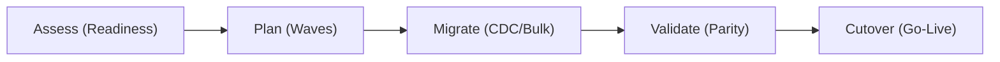

### 3. Distributed Migration Topology
Strategically orchestrating standardized migration engines across legacy data centers, diverse source databases, and multi-cloud targets, providing a unified institutional view of global transformation health.

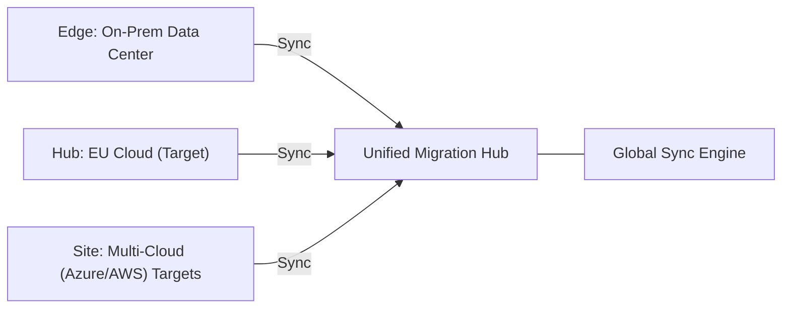

### 4. Migration Governance & High-Trust Data Plane Protection Flow
Executing complex logic for securing the bridge between legacy environments, transit networks, and target cloud VPCs, ensuring every organizational identity is verified and every data stream is according to institutional standards.

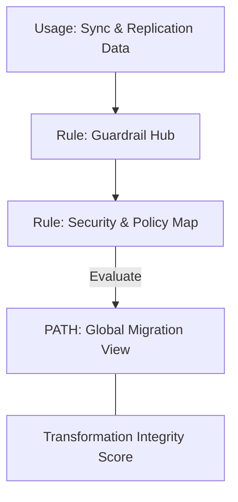

### 5. Multi-Cloud Transformation Federation Flow
Automatically managing unified modernization standards across Azure SQL, AWS RDS, GCP Cloud SQL, and Snowflake, ensuring institutional replication consistency and security boundaries by default.

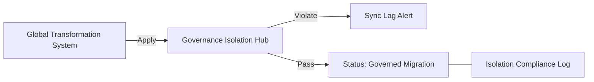

### 6. Encryption & Perimeter Protection Flow (Migration Standard)
Managing the lifecycle of a replication request, automatically enforcing institutional TLS 1.3, Private Link integration, and resource encryption standards as required by security policy, ensuring zero-latency security confidence.

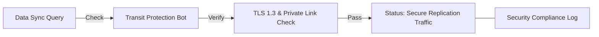

### 7. Institutional Migration Maturity Scorecard
Grading organizational performance based on key indicators: Zero-Downtime Success Rates, Automated Schema Conversion Coverage, and Data Validation Parity.

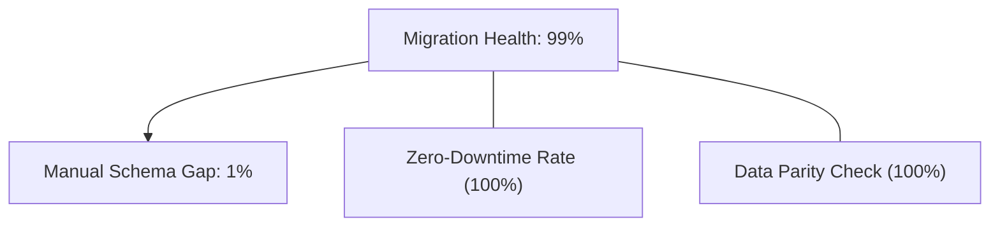

### 8. Identity & RBAC for Transformation Governance
Managing fine-grained access to migration hubs, provisioning workers, and audit logs between Migration Architects, DBAs, and PMO Managers.

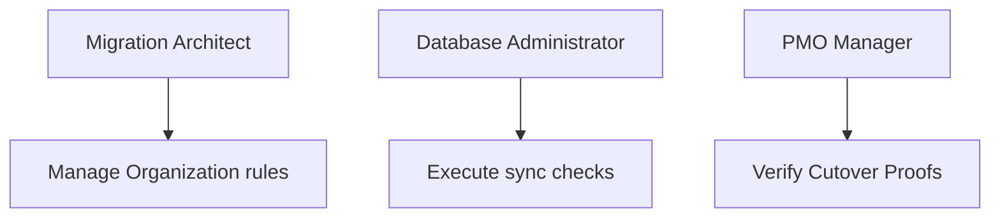

### 9. IaC Deployment: Migration-Hub-as-Code Framework
Using modular Terraform to deploy and manage the versioned distribution of the transformation tracking hubs, policy protection workers, and forensic metadata lakes.

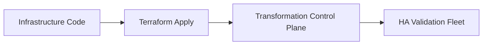

### 10. AIOps Migration Drift & Risk Validation Flow
Using advanced analytics to identify sudden surges in replication lag, schema conversion failures, suspicious configuration drifts, or unusual performance degradation that could result in institutional risk or downtime.

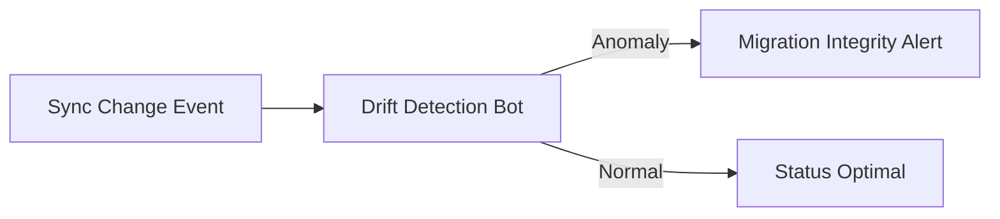

### 11. Metadata Lake for Forensic Migration Audit
Storing long-term records of every database assessed (metadata), every replication stream executed, and every cutover history for institutional record-keeping, compliance auditing, and post-provisioning forensics.

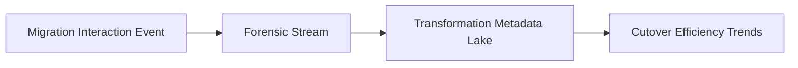

---

## 🏛️ Core Governance Pillars

1.  **Unified Foundation Coordination**: Maximizing velocity by centralizing all modernization workflows through a single institutional plane.
2.  **Automated Schema Provisioning**: Eliminating "manual code translation" scenarios through proactive orchestration and pattern verification.
3.  **Sequential Transformation Intelligence**: Ensuring zero-interruption operations through dependency-aware CDC-driven platform engineering.
4.  **Zero-Trust Transit Protection**: Automatically enforcing identity-based access and Private Link evaluation across all migration tiers.
5.  **Autonomous Operations Logic**: Guaranteeing reliability through automated industry-specific cutover monitoring runbooks.
6.  **Full Migration Auditability**: Immutable recording of every bulk load, CDC delta, and cutover provision for institutional forensics.

---

## 🛠️ Technical Stack & Implementation

### Migration Engine & APIs
*   **Framework**: Python 3.11+ / FastAPI.
*   **Performance Engine**: Custom Python-based logic for multi-cloud database synchronization and DORA-style readiness metrics.
*   **Integrations**: Native connectors for AWS DMS, Azure Database Migration Service, Debezium, and Oracle GoldenGate.
*   **Persistence**: PostgreSQL (Migration Ledger) and Redis (Live Sync State).
*   **Auth Orchestrator**: Federated OIDC/SAML for least-privilege transformation management access.

### Governance Dashboard (UI)
*   **Framework**: React 18 / Vite.
*   **Theme**: Dark, Slate, Indigo (Modern high-fidelity transformation aesthetic).
*   **Visualization**: D3.js for migration topologies and Recharts for readiness velocity analytics.

### Infrastructure & DevOps
*   **Runtime**: AWS EKS or Azure Kubernetes Service (AKS) for management plane.
*   **Migration Hub**: Managed event sourcing for immutable transformation timeline reconstruction.
*   **IaC**: Modular Terraform for deploying the migration landing zone and validation fleet.

---

## 🏗️ IaC Mapping (Module Structure)

| Module | Purpose | Real Services |
| :--- | :--- | :--- |
| **`infrastructure/migration_hub`** | Central management plane | EKS, PostgreSQL, Redis |
| **`infrastructure/sync_workers`** | Distributed automation workers | Azure, AWS, GCP APIs |
| **`infrastructure/replication_pipes`** | Transformation Orchestration Hubs | Webhooks, Kafka |
| **`infrastructure/auditing`** | Forensic cutover sinks | S3, Athena, Quicksight |

---

## 🚀 Deployment Guide

### Local Principal Environment
```bash
# Clone the Database Migration Hub repository
git clone https://github.com/devopstrio/database-migration-hub.git
cd database-migration-hub

# Configure environment
cp .env.example .env

# Launch the Migration stack
make init

# Trigger a mock transformation request and automated guardrail validation simulation
make simulate-migration
```

Access the Management Portal at `http://localhost:3000`.

---

## 📜 License
Distributed under the MIT License. See `LICENSE` for more information.

---
<div align="center">
  <p>© 2026 Devopstrio. All rights reserved.</p>
</div>
